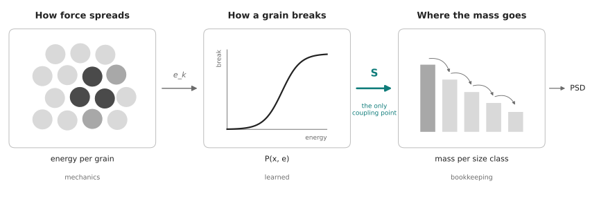
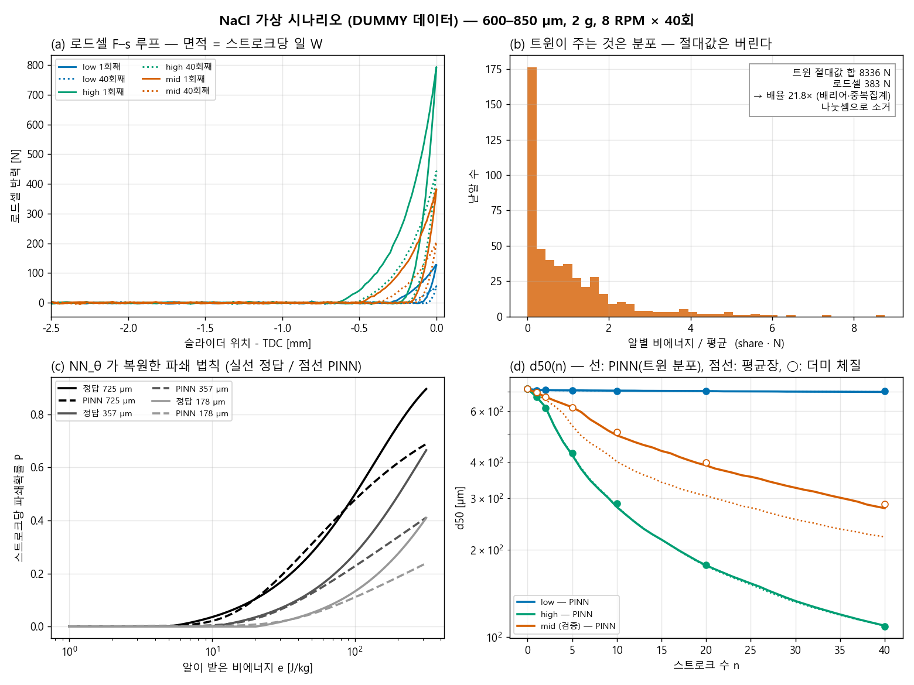

# PINN — 트윈의 하중을 파우더 입도로 옮기는 배선

트윈이 내는 **알별 하중**을 **스트로크 수별 입도(PSD)** 로 옮기는 다리(PBM × PINN)를
어떻게 배선할지, 그리고 **왜 그렇게 설계했는지** 적는 문서.

> 관련: 그림·논지는 [`Paper.md`](Paper.md) §1-4(Fig. 4)·§3-5(분쇄 한계 go/no-go),
> 접촉력 채널의 근거·검산은 [`DigitalTwin.md`](DigitalTwin.md) §27-11 ~ §27-13.
> 코드: [`Crusher_Genesis/pinn/`](../Crusher_Genesis/pinn/) (`nacl_dummy.py` → `features.py` → `train.py`).

---

## 목차

0. [한 줄 요약](#0-한-줄-요약)
1. [대상 — 정제가 아니라 파우더](#1-대상--정제가-아니라-파우더)
2. [왜 PINN 인가](#2-왜-pinn-인가)
3. [설계 결정 기록 — 무엇 때문에 이렇게 됐나](#3-설계-결정-기록--무엇-때문에-이렇게-됐나)
4. [배선도](#4-배선도)
5. [모델](#5-모델)
6. [캘리브레이션·검증 — 로드셀](#6-캘리브레이션검증--로드셀)
7. [NaCl 가상 시나리오 (더미 데이터)](#7-nacl-가상-시나리오-더미-데이터)
8. [작업 순서](#8-작업-순서)
9. [미결 질문](#9-미결-질문)
10. [변경 기록 · 다른 PC 에서 이어받기](#10-변경-기록--다른-pc-에서-이어받기)

---

## 0. 한 줄 요약

**무리 전체가 받는 일(W)은 로드셀이 정하고, 트윈은 그 일이 알마다 어떻게 나뉘는지(몫)만 준다.
PINN 은 그 분포 위에서 단일 입자 파쇄 법칙을 배운다.** 트윈의 알별 절대값은 쓰지 않는다.

---

## 1. 대상 — 정제가 아니라 파우더

**결정(2026-09-28): 정제는 더 이상 타겟이 아니다.** 대상은 파우더(시뮬의 uipc 낟알)다.

- PINN 에서 초기 조건이 결정적이라, 입도를 **구간으로 지정한 파우더**에서 출발한다.
  예: NaCl 600–850 µm(체 20/30 mesh 사이).
- 그래서 정제 파단(첫 타격 · Weibull)은 체인에서 뺀다. PBM 의 `n=0` = 지정 구간에 질량 1.0.
- 첫 실측 대상은 **NaCl** 이다.

---

## 2. 왜 PINN 인가

시뮬 낟알은 **깨지지 않는다**(uipc `Particle` = 반지름 고정 구). 트윈이 직접 내주는 것은 입도가
아니라 **하중 이력**이고, 입도로 가려면 다리가 필요하다. 그 다리가 PBM 이다.

```
 로드셀 + 트윈이 주는 것      ──►   PBM 이 아는 것        ──►   원하는 것
 무리 일 W, 알별 몫 분포            dm_i/dn = f(S_i, b_ij)      스트로크 수별 PSD
                      ╲                    ╱
                       ╲  미지 사상 S, b  ╱
                        ╲──  [NN_θ]  ──╱
```

PBM 의 구조(질량 보존, 큰 입자 → 작은 입자)는 안다. 모르는 것은 **하중이 커널로 어떻게
사상되는가**다. 그 사상을 NN 으로 두고 PBM 을 구조로 거는 것이 PINN 이다. 파쇄를 시뮬 안에서
직접 푸는 방식(FEM 손상, 입자 분할)은 수천 알 × 수십 스트로크에서 비용이 맞지 않는다.

### 2-1. PBM 은 역학이 아니라 **질량 장부**다 — 시뮬레이터와 엮이는 곳은 한 군데

    m_i(n+1) = m_i(n) − S_i m_i(n) + Σ_{j<i} b_ij S_j m_j(n)

PBM 식에는 힘도 운동도 없다. 유체의 연속방정식처럼 "어느 입도 구간에서 얼마가 빠져 어디로
갔나"만 세는 **보존식**이다. 통계식 같다는 느낌이 맞다.

**물리가 들어가는 자리는 파쇄확률 `S` 하나뿐이다.**



*그림: `Crusher_Genesis/pinn/plot_coupling_concept.py` 로 생성. 강조색은 결합 지점 `S` 에만 쓴다.*

```
 힘·운동 (시뮬레이터)  →  알별 에너지 e_k  →  S_i = mean_k P_θ(x_i, e_k)  →  PBM(장부)  →  PSD
                                           └──── 결합 지점은 여기 하나 ────┘
```

| 누가 | 무엇을 | 성격 |
|---|---|---|
| 시뮬레이터 (+로드셀) | 크러셔 힘이 알들 사이로 퍼진 결과 — **알별로 받은 에너지의 분포** | 역학 |
| PINN (`P_θ`) | 에너지를 받은 알이 깨질 확률 — **재료의 파쇄 법칙** | 학습 |
| PBM | 깨진 결과를 질량 보존에 맞게 입도 구간으로 **옮겨 적기** | 장부 |

**엮이지 않는 부분 — 두 가지.**

- **파편 분포 `b`** 는 시뮬레이터와 무관한 경험식(Austin)이다. 트윈 낟알은 깨지지 않으니
  파편 크기를 알려줄 수 없다.
- **한 방향이다.** PBM 에서 입자가 고와져도 트윈 낟알 크기는 그대로라, 고운 입자의 하중
  분포 변화가 되먹임되지 않는다(§9-1).

**"분포"의 뜻.** 한 스트로크 동안 트윈 알 N개가 각자 받은 에너지를 평균 1로 놓은 값들
`e_k/ē = share_k · N`. 대부분은 평균보다 적게(가려진 알은 거의 0), 소수는 5~8배를 받는다.
파쇄에는 문턱 에너지가 있어 **평균이 아니라 세게 맞은 소수가 파쇄를 정한다** — 그래서 분포를
쓰는 모델이 평균장보다 학습 밖 하중에서 6배 정확했다(§7-2).

---

## 3. 설계 결정 기록 — 무엇 때문에 이렇게 됐나

2026-09-28 논의를 순서대로 남긴다. 각 줄은 "질문 → 확인한 사실 → 그래서 내린 결정"이다.

### 3-1. 트윈의 알별 반력, 절대값을 그대로 쓸 수 있나 → **없다**

- **수치 정확도는 된다.** `NEWTON_TOL=1e-4` 런에서 접촉 gradient 와 운동량 역산이 알별로
  일치한다(비 1.00, cos +1.000, §27-12). 기본 tol 런(`RESULT_cfprofile0922` 등)은 이것조차
  안 된다(무리 합력/자중 1,896배).
- **물리적 절대값은 안 된다.** 이유:
  1. 낟알이 **강체 구**라, 빽빽한 더미에서는 평형식만으로 알별 힘이 하나로 정해지지 않는다
     (부정정). 어느 분포가 실제로 나오는지는 **접촉의 무름**이 고른다.
  2. 그 무름을 재료 탄성이 아니라 **IPC 배리어**(비관통용 수치 장치)가 대신한다.
  3. 크러셔는 **변위 구동**이라 힘 = 배리어 강성 × 배리어 틈(≤ `d_hat` 0.1 mm)이다.
     실측도 이와 맞다 — 최근접 간격이 `2R+d_hat` 에 고정되고 tol 을 100배 조여도 안 움직인다.
- 즉 동역학 시뮬레이터라서가 아니라 **접촉 모델이 재료 법칙이 아니라서**다. 알 사이 접촉
  강성을 재료 Hertz 강성에 맞추면(DEM 방식) 맞는 값이 나올 수 있다.

### 3-2. 알끼리의 2차 하중도 들어가나 → **들어가고 합산된다**

- 알–알 접촉(`PP`)이 쌍마다 따로 기록된다(`pair_*`, §27-13). 한 알이 받는 힘 = 판·봉투·
  다른 알과의 모든 접촉 합.
- 12알 기둥 검산에서 위에서 k번째 접촉이 정확히 알 k개 무게를 받았다 — 알→알 전달 확인.
- 단 스텝(dt=5 ms)마다의 준정적 접촉력이라 충돌 순간의 짧은 피크는 스텝 안에서 뭉개진다.
  8 RPM 준정적 압축에서는 문제가 작다.

### 3-3. 절대값을 보정할 방법 → **실측 반력으로 앵커한다**

- 보정 계수를 구할 때 비교 대상은 **모든 알 힘의 합이 아니다.** 알끼리 미는 힘은 작용·반작용
  이라 합하면 상쇄되고, 크기합은 중복 집계된다.
- 비교 대상은 **판 쪽으로 되미는 힘**이다. 준정적이므로 `슬라이더 반력 ≈ 파우더가 되미는 힘 +
  봉투 자체 저항` 이다. 봉투 몫은 **빈 봉투만 누른 반력**을 따로 재서 뺀다.

### 3-4. 결국 비율도 절대값도 미검증 → **비율만 트윈에서 가져온다**

- 알별 몫 `share_i = I_i / Σ I_j` (I_i = 스트로크 동안 알 i 의 **법선력 크기합** 적분) 는
  정의할 수 있다. 벡터합은 양쪽에서 눌리는 힘이 상쇄되므로 쓰지 않는다.
- 모든 접촉이 같은 배리어 법칙이고 변위 구동이면, 강성을 바꿀 때 알별 힘이 거의 같은 비율로
  움직여 **몫은 강성에 둔감할 수 있다.** 이것은 가설이고 **런 2개로 판정한다**
  (`contact_resistance` ×0.1 / ×10, `NEWTON_TOL=1e-4`, 분포가 겹치는지).
- 그래서 절대값 보정을 우회한다: `W_i = W_무리(로드셀) × share_i(트윈)`.

### 3-5. 알별 센서가 없는데 캘리브레이션을 어떻게 → **접촉 법칙을 맞춘다**

- 맞추는 것은 알별 힘이 아니라 **접촉 법칙**(`contact_resistance` 1개)이다. 층 전체의
  힘–변위 곡선이 맞으면 그 층을 이루는 접촉 법칙이 맞은 것이고, 알별 힘은 따라 나온다.
- 파라미터 1개라 **측정 1회로 정해지고, 다른 조건(장입량·입도) 1회로 검증**한다.
- 센서가 전혀 없으면 E·ν·입도로 Hertz 강성을 계산해 넣을 수 있지만 검증 수단이 없다.

### 3-6. 로드셀은 어디에 → **지금 위치(리니어 부시 뒤, 판 앞)면 된다**

- 준정적이라 하중 경로 위 어디서 재든 파우더를 거쳐 가는 힘은 같다. 차이는 **로드셀에
  무엇이 같이 걸리느냐**다.
- 로드셀이 리니어 부시 **다음**(부시와 판 사이)에 있으므로 부시 마찰은 로드셀에 닿기 전에
  빠진다 → 벽 쪽에 단 것과 같은 값이다. 둘 다 달 필요 없다.
- 남는 차이: 판 질량의 관성(8 RPM 에서 무시), 축이 어긋난 하중(장착 정렬만 확인).
- 모터 토크 역산값은 기구 마찰이 섞이므로 캘리브레이션에 쓰지 않는다.

---

## 4. 배선도

```
 실측 (모터 복구 후)                    트윈 (full_workflow.py, NEWTON_TOL=1e-4)
 로드셀 CSV  t, crank_deg, F_N          crush_<TAG>.npz  fld_fn_mag / pair_*, dof_q
     │                                       │
     ▼                                       ▼
 pinn/features.py ── 스트로크 분할(크랭크각 −π 통과) ──────────────────┐
     W_n, W_irr,n, τ_n  (로드셀)          share_k,n (트윈, 행 합 = 1)   │
     e_mean,n = W_n / M  [J/kg]           e_norm,k,n = share_k,n · N    │
     └───────────────────────────┬─────────────────────────────────────┘
                                 ▼
 pinn/train.py   S_i,n = mean_k P_θ(x_i, e_mean,n · e_norm,k,n)
                 m_{n+1} = m_n − S∘m_n + b (S∘m_n)
                 L = Σ (통과분율 예측 − 체질 실측)² + λ · 단조성 벌점
                                 ▼
 Fig. 4 (c)(d)
```

`features.py` 는 **절대값을 나눗셈으로 버린다.** 트윈 npz 에 어떤 배율이 곱해져 있든
(배리어·중복 집계) 결과가 같다.

---

## 5. 모델

### 5-1. 스트로크 단위 이산 PBM

입도 구간은 √2 체열: 850/600/425/300/212/150/106/75/53/0 µm (9구간).

    m_{n+1} = m_n − S∘m_n + b (S∘m_n)

타격이 스트로크마다 한 번이라 연속 ODE(`dm/dn`)보다 **스트로크 단위 사상**이 자연스럽다.
질량 보존이 정확히 성립하고 적분 오차가 없다.

### 5-2. NN_θ 는 **단일 입자 파쇄확률**을 배운다

    P_θ(x, e)  =  sigmoid(MLP(log x, log e))     입자 크기 x, 그 알이 받은 비에너지 e
    S_i,n      =  mean_k P_θ(x_i, e_mean,n · e_norm,k,n)

- NN 이 커널 `S_i` 를 직접 내지 않고 **단일 입자 법칙**을 배운다. 트윈의 알별 분포는 그 법칙을
  평균하는 **가중치**로 들어간다. 트윈이 주는 정보(분포)와 실측이 주는 정보(규모)가 각자 자리에
  들어가는 구조다.
- 단조성 `∂P/∂e ≥ 0`, `∂P/∂x ≥ 0` 은 autograd 벌점으로 건다. 뒤쪽이 **분쇄 한계**
  (작을수록 안 깨진다, Paper §3-5)다.
- 최세 구간(<53 µm)은 안 깨진다(`S_K = 0`).

### 5-3. 파쇄분포 b 는 구조로

    B(y) = φ y^γ + (1−φ) y^β   (Austin),   b_ij = B(상단_i / 하단_j) − B(상단_{i+1} / 하단_j)

파라미터 3개. `Σ_i b_ij = 1`, `b ≥ 0` 이 식에서 자동 성립한다. PSD 점이 적어 NN 으로 두면
식별이 안 되므로 **모수형**으로 둔다.

### 5-4. 입력을 왜 이것으로 골랐나

- **F_peak 가 아니라 일(W).** 8 RPM 반복 저에너지 압축에서는 파쇄가 피크힘보다 에너지에
  좌우되고(Vogel-Peukert, Bond), peak 는 해상도에 의존하는 가장 못 믿을 스칼라다(Paper §1-4).
- **W 는 로드셀에서.** 크랭크각 → 슬라이더 위치 `s(θ)` (r=20, L=80 mm) 로 `∮F ds` 를 적분한다.
  변위는 크랭크 각도에서 나오므로 따로 잴 필요가 없다.

---

## 6. 캘리브레이션·검증 — 로드셀

| 단계 | 무엇 | 쓰임 |
|---|---|---|
| 1 | 빈 봉투만 누른 반력 | 봉투 몫 제거 |
| 2 | 파우더 층 압축 곡선 1회 (로드셀, 크랭크각) | `contact_resistance` 결정 → 트윈 절대값 |
| 3 | 다른 장입량 또는 입도로 1회 | 2의 검증 |
| 4 | 운전 런의 로드셀 CSV | PINN 입력 `W_n` (항상 필요) |

**주의 — 2·3은 알별 절대값이 필요할 때만 필요하다.** 지금 설계(`W × share`)는 4만으로 돈다.
2·3을 하는 이유는 §3-4 의 몫 불변성이 깨졌을 때의 대비다.

---

## 7. NaCl 가상 시나리오 (더미 데이터)

**모터 고장으로 실측이 없어서(2026-09-28) 정답을 아는 가짜 데이터로 파이프라인을 먼저
세웠다.** 여기 숫자는 NaCl 물성에 대한 주장이 아니다. 묻는 것은 하나다 — **이 측정 설계로
커널이 복원되는가.**

### 7-1. 시나리오

| 항목 | 값 | 비고 |
|---|---|---|
| 시료 | NaCl 2.0 g, **600–850 µm** | 부피밀도 1200 kg/m³(더미) → 층 두께 1.85 mm |
| 운전 | 8 RPM × **40 스트로크**(5분) | "어떤 시간" |
| 하중 수준 | 벽 간격으로 TDC 압축 0.30 / 0.50 / 0.65 mm | "어떤 힘" → 첫 스트로크 피크 129 / 382 / 794 N |
| 층 거동 | 지수형 압밀 + 잔류압축 제하 + 스트로크마다 영구 압밀 | 40회째 피크 56 / 204 / 444 N |
| 트윈 대체 | 500알, 지수분포 몫(힘사슬), 25% 차폐, 스트로크마다 40% 재배열 | **절대값에 가짜 배리어 배율 7.3× 를 곱해 둠** |
| 정답 커널 | Vogel-Peukert `P = 1−exp(−f x (e−e_min(x)))`, `e_min ∝ 1/x` + Austin(0.4, 0.9, 4.0) | `truth.json` |
| 체질 | n = 0, 1, 2, 5, 10, 20, 40 | 잡음 3% 상대 + 0.005 절대 |
| 학습 / 검증 | low + high 로 학습, **mid 는 학습에 안 씀** | 보간 일반화 |

파일 모양은 실제 실험과 같다(`loadcell_*.csv`, `sim_*.npz`, `psd_*.csv`). 실측과 실런이 나오면
**파일만 바꿔 끼우면** 나머지가 그대로 돈다.

### 7-1b. 더미 데이터는 이렇게 만들었다 (`nacl_dummy.py`, 단계별)

시드 `20260928` 고정 — 같은 PC 든 다른 PC 든 **같은 파일이 다시 나온다.** 하중 수준마다
40스트로크를 아래 순서로 돈다.

1. **크랭크 기구.** 크랭크각 `θ = −π + ω t` (8 RPM, 한 바퀴 7.5 s, dt = 5 ms).
   슬라이더 위치 `s(θ) = r cosθ + √(L² − r² sin²θ)` (r = 20, L = 80 mm). θ = 0 이 TDC.
2. **층 압축량.** `δ(θ) = δ_max,n − (r + L − s(θ))`. 벽이 고정이므로 `δ_max` 가 "힘의 크기"
   손잡이다(0.30 / 0.50 / 0.65 mm).
3. **로드셀 반력 (실측 대체).**
   - 하중(θ ≤ 0): `F = σ₀ (exp(δ/(H₀ ε_c)) − 1) · A`  (σ₀ = 50 kPa, ε_c = 0.12, A = 30×30 mm)
   - 제하(θ > 0): `F = F_max ((δ − δ_r)/(δ_max − δ_r))^2.5`, 잔류 `δ_r = 0.6 δ_max`
     → 하중·제하 곡선이 갈라져 비가역 일 `W_irr` 이 생긴다.
   - 잡음 1.5 N 을 더해 `loadcell_<lv>.csv` 로 쓴다.
4. **영구 압밀.** 스트로크가 끝날 때마다 `s_perm += 0.08 δ_max (1 − s_perm/0.12 mm)`,
   다음 스트로크 `δ_max = δ₀ − s_perm`. 같은 벽 간격에서도 힘이 점점 줄어든다(피크 382 → 204 N).
5. **트윈 알별 하중 (트윈 대체).** 500알에 몫 `w_i ~ Exp(1)` 를 준다(힘사슬 = 지수 꼬리). 25%는
   ×0.05 로 가려진 알. 스트로크마다 40%를 새 난수로 재배열. 알별 법선력 크기합은
   `f_i(t) = K_BARRIER · Z · F(t) · w_i/Σw · (1 + 5% 잡음)` 이다. `Z = 3` 은 중복 집계,
   **`K_BARRIER = 7.3` 은 일부러 넣은 가짜 배리어 배율**이다. 0.05 s 간격으로
   `sim_<lv>.npz` 에 `fld_fn_mag` 키로 쓴다 — `full_workflow.py` 의 crush npz 와 같은 키다.
6. **정답 PBM.** 스트로크당 일 `W_n = ∫F ds`(하중 구간), 알별 비에너지
   `e_k = (W_n/M) · share_k · N`. 선택함수 `S_i = mean_k P_VP(x_i, e_k)`,
   `P_VP = 1 − exp(−f x (e − e_min(x)))`, `f = 10 kg/(J·m)`, `e_min = 5 J/kg × (725 µm / x)`.
   파쇄분포 Austin(φ 0.4, γ 0.9, β 4.0). `m ← m − S∘m + b(S∘m)`.
7. **체질 (실측 대체).** n = 0, 1, 2, 5, 10, 20, 40 에서 `m` 에 3% 상대 + 0.005 절대 잡음,
   재정규화 → `psd_<lv>.csv`. 잡음 없는 참값과 정답 커널은 `truth.json` 에만 있다.

**수치 선택의 근거.** 기구(r, L, 8 RPM)는 실기 값(`motor_spec.md`). 피크 반력 범위는 실측
force gauge 394–896 N 에 들어오도록 σ₀·ε_c 를 골랐다. 나머지(부피밀도, 면적, VP 계수, Austin)는
**그럴듯한 더미**이고 NaCl 문헌값이 아니다.

### 7-2. 결과



통과분율 RMSE (잡음 없는 정답 대비):

| 모델 | low | high | **mid (검증)** | Austin φ / γ / β |
|---|---|---|---|---|
| **트윈 분포 사용** | 0.006 | 0.007 | **0.012** | 0.41 / 0.93 / 3.05 |
| 평균장 (`e_mean` 만) | 0.007 | 0.007 | 0.075 | 0.42 / 0.93 / 2.97 |
| 정답 | | | | 0.40 / 0.90 / 4.00 |

- **트윈 분포를 쓰면 학습에 없던 하중에서 6배 정확하다.** 평균장은 학습 두 수준에는 똑같이
  맞추지만 mid 에서 d50 을 크게 과소예측한다(그림 d 점선). 문턱이 있는 파쇄 법칙에서는
  평균이 아니라 **꼬리(세게 맞은 소수 알)** 가 파쇄를 정하기 때문이다.
- **φ, γ 는 복원, β 는 안 된다(3.0 vs 4.0).** β 는 가장 고운 파편의 비율을 정하는데 그 구간
  질량이 작아 체질 잡음에 묻힌다. 실측 때 <75 µm 구간을 더 정밀하게 재야 한다는 뜻이다.
- **파쇄 법칙은 데이터가 있는 에너지 범위(≲100 J/kg)에서만 복원된다**(그림 c). 그 위는 외삽이라
  틀린다 — 운전 하중 범위를 넘어 쓰면 안 된다.

### 7-3. 이 결과가 **말하지 못하는 것**

- 정답 데이터를 "분포 위 평균" 구조로 만들었으므로 **분포 모델이 이기는 것은 일부 설계상 당연**하다.
  실측에서 같은 차이가 나오는지가 진짜 검증이다.
- 트윈 몫 분포는 가짜(지수분포)다. 실제 트윈 분포, 그리고 그것이 `contact_resistance` 에 둔감한지
  (§3-4)는 아직 안 쟀다.

실행:
```bash
cd Crusher_Genesis/pinn && python nacl_dummy.py && python train.py
```

---

## 8. 작업 순서

| # | 작업 | 막힘 |
|---|---|---|
| ✅ | 더미 파이프라인 — 생성 → 특징 → PINN → 복원 검증 (§7) | — |
| 1 | 몫 불변성 판정: `contact_resistance` ×0.1 / ×10, `NEWTON_TOL=1e-4`, R=1.0 mm 332알 15 s | 런 시간 (2레인, `NO_VIDEO=1`) |
| 2 | 트윈 입자 크기를 NaCl 600–850 µm (R≈0.36 mm) 로 — `d_hat/R` 비가 0.28 로 바뀌므로 배리어 잠금 재확인 | 1 |
| 3 | 트윈 실런 npz 를 `features.py` 에 연결 (`fld_fn_mag` 또는 `pair_*`) | 2 |
| 4 | 모터 복구 → 빈 봉투 반력, NaCl 운전 런 로드셀 CSV | **모터** |
| 5 | 체질 PSD (스트로크 3~4점 이상, <75 µm 구간 정밀) | 4 |
| 6 | 학습 → Fig. 4(d) 실데이터판 | 5 |

---

## 9. 미결 질문

1. **알 반경 하나 ↔ 입도 구간 K개.** 트윈 낟알은 한 크기다. 지금은 모든 구간이 같은 몫 분포를
   겪는다고 둔다(평균장 가정). 파쇄가 진행되면 고운 입자가 굵은 입자 틈에 숨어 하중을 덜 받을
   수 있다 — 반경별 런(R 2~3개)으로 몫 분포가 크기에 따라 달라지는지 봐야 한다.
2. **몫의 강성 불변성**(§3-4). 깨지면 §6 의 2·3단계로 절대값 보정을 해야 한다.
3. **비정질화.** 분쇄 한계 아래에서 에너지는 파단이 아니라 비정질화로 간다(Paper §3-5).
   PBM 은 질량 분율만 추적하므로 이 누수는 `P(x, e)` 포화로만 보인다. XRD 결정화도를 두 번째
   출력으로 붙일지.
4. **층 압밀과 파쇄의 결합.** 입자가 고와지면 층이 더 조밀해져 같은 벽 간격에서 힘이 바뀐다.
   로드셀이 매 스트로크 W 를 재므로 입력 쪽은 자동 반영되지만, 운전 조건(벽 간격)으로 결과를
   예측하려면 이 결합을 따로 모델링해야 한다.
5. **알별 히스토리가 사라진다 (2026-09-30 논의).** `S_i = mean_k P_θ(x_i, e_k)` 는 확률을 먼저
   계산하고 평균하므로 한 스트로크 안의 분포(꼬리)는 남는다. 그러나 PBM 은 구간별 질량만 세고
   알 번호가 없어서 **스트로크 사이가 무기억(Markov)** 이다 — 다섯 번 세게 맞고 버틴 입자와
   방금 쪼개져 들어온 입자가 같은 확률로 깨진다. 잃는 것은 둘이다.
   - **누가 반복해서 맞나** — 힘사슬 자리에 있는 알이 계속 세게 맞는 상관. 트윈에는 있다.
   - **손상 누적** — 문턱 아래 타격이 쌓여 입자가 약해지는 피로. 8 RPM 반복 저에너지 압축이라
     이쪽이 클 수 있다.

   **ID 는 이미 공짜다.** `fld_fn_mag (프레임, 낟알)` 의 열 번호가 곧 알 ID 이고, 트윈 낟알은
   깨지지 않으므로 전 런 동안 유지된다. 문제는 그 ID 를 PBM 쪽으로 넘기는 방법이다. 후보:

   | 안 | 내용 | 걸리는 점 |
   |---|---|---|
   | A. 알별 이력 입력 | 트윈 알 k 의 누적 에너지 `D_k,n = Σ_{m≤n} e_k,m` 를 추적해 `P_θ(x, e, D)` 로 입력 확장 | 트윈 알은 안 깨지므로 ID 는 **입자가 아니라 자리**다. PBM 에서 깨진 파편의 이력을 어떻게 이어받나 |
   | B. 손상 상태 PBM | 질량을 `m_i` → `m_i,d` (입도 × 손상 구간)로 쪼개고, 타격마다 손상 구간 사이를 옮긴다 | 구간 수가 곱으로 늘고, 손상은 체질로 안 보인다 → 식별성 |
   | C. 두 과정 분리 | 손상 누적과 파쇄 판정을 따로 모델링한다 (구체 형태 미정) | 분리 경계를 무엇으로 두나 |

   먼저 할 일: 트윈 실런에서 **같은 알이 스트로크마다 몫 상위에 반복해서 드는지**(몫의 스트로크 간
   자기상관)를 잰다. 상관이 약하면(더미의 40% 재배열처럼 섞이면) 무기억 가정으로 충분하다.
6. **취성 파쇄를 시뮬 안에서 (2026-09-30 논의).** 어려운 과제지만 중요하다고 판단. 걸림은
   **빌드 때 입자 수가 고정**된다는 점이다. 후보:

   | 안 | 내용 | 걸리는 점 |
   |---|---|---|
   | A. 입자 풀 | 최대 개수를 미리 만들고, 파쇄 시 부모를 끄고 자식을 켠다 | 부피 보존 자식 구들은 부모 구 안에 안 겹치고 못 들어간다(구 충전율 ≤ 74%) → IPC 초기 겹침은 world 무효. uipc 런타임 활성/비활성 지원은 **미확인** |
   | B. 결합입자 모델(BPM) | 한 알 = 작은 구 여러 개를 본드로 묶음, 본드가 끊기면 파편 | 입자 수가 처음부터 고정이라 제약과 맞는다(DEM 분쇄 표준). 비용 = 알 × 서브입자, 파편 크기 해상도 = 서브입자. uipc 에 끊어지는 본드가 있는지 **미확인** |
   | C. 스트로크 경계 재빌드 | 한 스트로크 돌리고 멈춤 → 파쇄 판정 → 새 입자 목록으로 씬 재빌드 | PBM 도 스트로크 단위라 맞고, §2-1 의 한 방향 문제(PBM 이 고와져도 트윈이 모름)가 풀린다. 재빌드 비용, 위치·속도·봉투 상태 이어받기 |
   | D. 역할 분리 | 단일 알 파쇄는 B 로 보정, 무리는 C 로 | 두 체계를 다 만들어야 한다 |

   **MPM 은 이 프로젝트에서 안 된다.** MPM 의 파쇄는 입자 분할이 아니라 연속체 손상으로 물질점이
   떨어지는 방식(CD-MPM 계열)이고 입자 수는 여기서도 고정이다. 그보다 앞서 IPC 커플러에 MPM 이
   없고 `FEM.Cloth` 봉투가 IPC 전용이라 공존이 안 된다(2026-09-04 실측). 알 하나의 파쇄를
   풀려면 격자가 알보다 훨씬 작아야 해서 수천 알이면 비용도 맞지 않는다.

   현재 기울기: **C** (지금 파이프라인에 가장 덜 침습적).
7. **다분산 초기 입도.** 초기 입도는 단일 구간이 아니라 여러 분포로 주어질 수 있다.
   - **PBM** — 원래 다분산 식이다. 초기 조건을 구간 하나에 1.0 대신 분포 벡터로 주면 된다.
   - **트윈** — `add_grains` 는 호출 한 번에 반경 하나지만(`Powder_flip_test/ipc_grain_coupler.py`)
     크기별로 여러 번 부르면 구간별로 만들 수 있다. 연속 분포는 구간으로 근사한다.
   - **걸림** — `contact_d_hat` 이 전역 하나라 **가장 작은 알** 기준으로 `d_hat/R ≤ 0.2` 를
     맞춰야 한다. 크기 차가 크면 작은 알 개수가 폭증한다.
   - **이득** — 다분산 트윈이면 크기 구간별 몫 분포를 직접 재서 9-1 에 바로 답할 수 있다.
   - **미확인** — 반경이 다른 spec 을 섞었을 때 uipc 가 제대로 도는지. 작은 probe 로 먼저 확인.

---

## 10. 변경 기록 · 다른 PC 에서 이어받기

### 10-1. 2026-09-28 — 무엇을 바꿨나

| 파일 | 상태 | 내용 |
|---|---|---|
| `docs/PINN.md` | 신규 | 이 문서. 설계 결정(§3), PBM 의 역할(§2-1), 더미 시나리오(§7) |
| `docs/pinn_coupling_concept.svg/.png` | 신규 | §2-1 개념도 |
| `Crusher_Genesis/pinn/nacl_dummy.py` | 신규 | 더미 데이터 생성기 (§7-1b) |
| `Crusher_Genesis/pinn/features.py` | 신규 | 로드셀 CSV + 트윈 npz → 스트로크별 W, W_irr, 알별 몫 |
| `Crusher_Genesis/pinn/train.py` | 신규 | PBM × PINN 학습, 평균장 비교, 결과 그림 |
| `Crusher_Genesis/pinn/plot_coupling_concept.py` | 신규 | 개념도 생성 |
| `Crusher_Genesis/pinn/RESULT_dummy_nacl/` | 신규 | PSD CSV, `truth.json`, `report.json`, 결과 그림 |
| `full_workflow.py` | **변경 없음** | 트윈 쪽은 손대지 않았다. `fld_fn_mag` / `pair_*` 가 이미 저장된다 |

**리포에 안 올린 것:** `loadcell_*.csv`(각 1.5 MB), `sim_*.npz` — 시드 고정이라
`nacl_dummy.py` 를 돌리면 똑같이 다시 생긴다(몇 초).

### 10-2. 재현

필요: Python 3.11, `numpy`, `torch`(CPU 로도 됨), `matplotlib`. 결과 그림의 한글은
`Malgun Gothic` 폰트를 쓴다(없는 PC 에서는 글자만 깨지고 계산은 같다). Windows 콘솔이면
`PYTHONIOENCODING=utf-8` 을 먼저 건다.

```bash
cd Crusher_Genesis/pinn
PYTHONIOENCODING=utf-8 python nacl_dummy.py
PYTHONIOENCODING=utf-8 python train.py
```

`train.py` 는 이 PC(RTX 5070)에서 약 2분. 기대 출력:

    트윈 분포 사용     low 0.0057  high 0.0074  mid* 0.0122   Austin φ=0.41 γ=0.93 β=3.05
    평균장(e_mean 만)  low 0.0065  high 0.0066  mid* 0.0747   Austin φ=0.42 γ=0.93 β=2.97

GPU 난수 차이로 셋째 자리가 조금 다를 수 있다. mid 에서 분포 모델이 평균장보다 수 배 낫다는
결론이 바뀌면 그건 이상이다.

### 10-3. 실데이터로 바꿔 끼우는 법

| 더미 파일 | 실제로 대체할 것 | 맞출 형식 |
|---|---|---|
| `loadcell_<lv>.csv` | 로드셀 로그 | 첫 줄 주석 1줄, 헤더 `t_s,crank_deg,F_N`. 크랭크각은 TDC = 0°, 후퇴점 = ±180° |
| `sim_<lv>.npz` | `full_workflow.py` 의 `crush_<TAG>.npz` (`NEWTON_TOL=1e-4`) | `fld_fn_mag (프레임, 낟알)`, `dof_q[:, 0]` = 크랭크각 [rad]. 실런의 `dof_q` 열 순서는 확인 필요 |
| `psd_<lv>.csv` | 체질 결과 | 주석 1줄 + 헤더, 행 = 스트로크 수 n, 열 = 9개 구간 질량분율 |

`truth.json` 은 실험에 없다 — 실데이터에서는 `train.py` 의 정답 대비 RMSE 부분을 체질 실측 대비로
바꿔야 한다.

### 10-4. 다음 할 일

§8 표의 1번(몫 불변성 판정, `contact_resistance` ×0.1 / ×10 런 2개)부터. 이 런은 Genesis/uipc
스택이 있는 PC 에서 돌린다(`probe/drivers/newton_conv_sweep.sh` 와 같은 조건에 `GRAIN_RESIST`
노브를 새로 배선해야 한다 — `add_grains(contact_resistance=…)`, 아직 없음).
